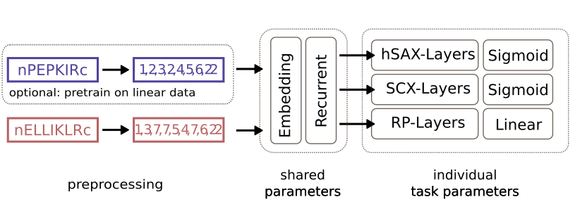

 

A python package for multi-dimensional retention time prediction for linear and crosslinked 
peptides using a (siamese) deep neural network architecture.
---

- [Overview](#overview)
- [Description](#Description)
- [Installation](#Installation)

---
## overview

xiRT is a deep learning tool to predict the retention times(s) of linear and crosslinked peptides 
from multiple fractionation dimensions including RP (typically coupled to the mass spectrometer). 
xiRT was developed with a combination of SCX / hSAX / RP chromatography. However, xiRT supports
all available chromatography methods.

xiRT requires the columns shown in the table below. Importantly, the xiRT framework requires that 
CSM are sorted such that in the Peptide1 - Peptide2, Peptide1 is the longer or lexicographically 
larger one for crosslinked RT predictions.

## Description
xiRT is meant to be used to generate additional information about CSMs for machine learning-based
rescoring frameworks (similar to percolator). However, xiRT also delivers RT prediction for various 
scenarios. Therefore xiRT offers several training / prediction  modes that need to be configured 
depending on the use case. At the moment training, prediction, crossvalidation are the supporte
modes.
- *training*: trains xiRT on the input CSMs (using 10% for validation) and stores a trained model
- *prediction*: use a pretrained model and predict RTs for the input CSMs
- *crossvalidation*: load/train a model and predict RTs for all data points without using them
in the training process. Requires the training of several models during CV

Note: all modes can be supplemented by using a pretrained model ("transfer learning").

### Installation and Usage

xiRT is a python package that comes with a executable python file. To run xiRT follow the steps 
below.

#### Installation
To install xiRT simply run the command below. We recommend to use an isolated python environment,
for example by using pipenv or conda. 
Using pipenv:
>pipenv shell
>
>pip install xirt

To enable CUDA support, the easiest thing is to create a conda environment. Conda will take care of 
the CUDA libraries and other dependencies.
> conda create --name xirt_env python=3.7
>
>conda activate xirt_env
>
> pip install xirt
>
> conda install tensorflow-gpu

#### Usage
The command line interface (CLI) requires three inputs:
1) input PSM/CSM file
2) a [YAML](https://docs.ansible.com/ansible/latest/reference_appendices/YAMLSyntax.html) file to configure the neural network architecture
3) another YAML file to configure the general training / prediction behaviour, called setup-config

To use xiRT these options are put together as shown below:
> xirt(.exe) -i peptides.csv -o out_dir -x xirt_params -l learning_params

To adapt the xiRT parameters a yaml config file needs to be prepared. The configuration file
is used to determine network parameters (number of neurons, layers, regularization) but also for the
definition of the prediction task (classification, regression, ordered regression). Depending
on the decoding of the target variable the output layers need to be adapted. For standard RP 
prediction, regression is essentially the only viable option. For SCX/hSAX (general classification
from fractionation sexperiments) the prediction task can be formulated as classification, 
regression or ordered regression. For the usage of regression for fractionation it is recommended 
that the estimated salt concentrations are used as target variable for the prediction  (raw 
fraction numbers are possible too).

### input format
| short name         | explicit column name | description                                                                    | Example     |
|--------------------|----------------------|--------------------------------------------------------------------------------|-------------|
| peptide sequence 1 | Peptide1             | First peptide sequence for crosslinks                                        | PEPRTIDER   |
| peptide sequence 2 | Peptide2             | Second peptide sequence for crosslinks, or empty                                 | ELRVIS      |
| link site 1        | LinkPos1             | Crosslink position in the first peptide (0-based)                                    | 3           |
| link site 2        | LinkPos2             | Crosslink position in the second peptide (0-based                                | 2           |
| precursor charge   | Charge               | Precursor charge of the crosslinked peptide                                    | 3           |
| score              | Score                | Single score from the search engine                                            | 17.12       |
| unique id          | CSMID                | A unique index for each entry in the result table                              | 0           |
| decoy              | isTT                 | Binary column which is True for any TT identification and False for TD, DD ids | TT          |
| fdr                | fdr                  | Estimated false discovery rate                                                 | 0.01        |
| fdr level          | fdrGroup             | String identifier for heteromeric and self links (splitted FDR)                | heteromeric |

The first four columns should be self explanatory, if not check the [sample input](https://github.com/Rappsilber-Laboratory/xiRT/tree/master/sample_data). 
The fifth column ("CSMID") is a unique(!) integer that can be used as to retrieve CSMs. In addition, 
depending on the number retention time domains that should to be learned/predicted the RT columns 
need to be present. The column names need to match the configuration in the network parameter yaml.

#### xiRT config
This file determines the network architecture and training behaviour used in xiRT.

#### Setup config
This file determines the input data to be used and gives some training procedure options.

### Contributors
- Sven Giese

## Citation
If you consider xiRT helpful for your work please cite our manuscript. Currently, in preparation
on soon on bioRxiv.org "xiRT: Retention Time Prediction using Neural Networks increases 
Identifications in Crosslinking Mass Spectrometry".

## RappsilberLab
The Rappsilber applies and developes crosslinking chemistry methods, workflows and software.
Visit the lab page to learn more about the developed [software](https://www.rappsilberlab.org/software/).