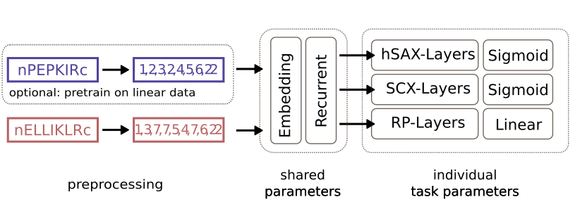

 

A python package for multi-dimensional retention time prediction for linear and crosslinked 
peptides using a (Siamese) deep neural network architecture.
---

- [Overview](#overview)
- [Description](#Description)
- [Installation](#Installation)

---
## overview

xiRT is a deep learning tool to predict the separation behavior (i.e. retention times) of linear 
and crosslinked peptides from single to multiple fractionation dimensions including RP (typically 
directly coupled to the mass spectrometer). xiRT was developed to predict retention times from a 
multi-dimensional separation from the combination of SCX / hSAX / RP chromatography. 
However, xiRT supports all available chromatographic and other peptide separation 
methods

xiRT requires the columns shown in the table below. Importantly, the xiRT framework requires that 
CSM are sorted such that in the Peptide1 - Peptide2, Peptide1 is the longer or lexicographically 
larger one for crosslinked RT predictions. The sorting is done internally and may result in swapped
peptide sequences in the output tables.

## Description
xiRT is meant to be used to generate additional information about CSMs for machine learning-based
rescoring frameworks but the usage can be extended to spectral libraries, targeted acquisitions etc.
Therefore xiRT offers several training / prediction  modes that need to be configured 
depending on the use case. At the moment training, prediction, crossvalidation are the supported
modes.
- *training*: trains xiRT on the input CSMs (using 10% for validation) and stores a trained model
- *prediction*: use a pretrained model and predict RTs for the input CSMs
- *crossvalidation*: load/train a model and predict RTs for all data points without using them
in the training process. Requires the training of several models during CV

Note: all modes can be supplemented by using a pretrained model ("transfer learning") when not 
enough training data is available to achieve robust prediction performance.

This readme only gives a brief overview about xiRTs functions and parameters. Please refer
to the [documentation](https://xirt.readthedocs.io/en/latest/) for more details and examples.

### Installation and Usage

xiRT is a python package that comes with a executable python file. To run xiRT follow the steps 
below.

#### Requirements
xiRT requires a running python installation on windows/mac/linux. All further requirements
are managed during the installation process via pip or conda. xiRT was tested using python >3.7 with
TensorFlow 1.4 and python >3.8 and TensorFlow >2.0. A GPU is not mandatory to run xiRT, however
it can greatly decrease runtime. Further system requirements depend on the data sets to be used.

#### Installation
To install xiRT simply run the command below. We recommend to use an isolated python environment,
for example by using pipenv **or** conda. Installation should finish within minutes.

Using pipenv:
>pipenv shell
>
>pip install xirt

Optional: To enable CUDA support, using a [conda environment](https://docs.conda.io/projects/conda/en/latest/user-guide/tasks/manage-environments.html#creating-an-environment-with-commands) is the easiest solution.  
Conda will take care of the CUDA libraries and other dependencies. Note, xiRT runs either on CPUs
or GPUs. To use a GPU specify CuDNNGRU/CuDNNLSTM as type in the LSTM settings, to use a CPU set the
type to GRU/LSTM.

> conda create --name xirt_env python=3.8
>
>conda activate xirt_env
>
> pip install xirt

Hint:
The plotting functionality for the network is not enabled per default because
pydot and graphviz sometimes make trouble when they are installed via pip. If on linux,
simply use *sudo apt-get install graphviz*, on windows download latest graphviz package from 
[here](https://www2.graphviz.org/Packages/stable/windows/), unzip the content of the file and the
*bin* directory path to the windows PATH variable. These two packages allow the visualization
of the neural network architecture. xiRT will function also without this functionality.

Older versions of TensorFlow will require the separate installation of tensorflow-gpu. We recommend
to install tensorflow in conda, especially if GPU usage is desired.

#### General Usage

This section explains the general usage of xiRT via the command line. A minimal working example
in a quick-start guide fashion is available [here](https://xirt.readthedocs.io/en/latest/usage.html#quick-start).

The command line interface (CLI) requires three inputs:
1) input PSM/CSM file
2) a [YAML](https://docs.ansible.com/ansible/latest/reference_appendices/YAMLSyntax.html) file to configure the neural network architecture
3) another YAML file to configure the general training / prediction behaviour, called setup-config

Configs are either available via [github](https://github.com/Rappsilber-Laboratory/xiRT/tree/master/default_parameters).
Alternatively, up-to-date configs can be generated from the xiRT package itself:

> xirt -p learning_params.yaml
>
> xirt -s xirt_params.yaml

To use these two parameter files in xiRT and store the results in a directory called *out_dir*,  
run the following command:

> xirt -i psms.csv -o out_dir -x xirt_params.yaml -l learning_params.yaml

To adapt the xiRT parameters to your needs, edits to the YAML config file are needed. The configuration file
is used to determine the prediction task (rp, scx, hsax, ...) but also to set important network parameters 
(number of neurons, layers, regularization). While the default network configuration offers suitable
parameters for most situations, the prediction tasks need further adjustments. The adjustments
need to account for the type and number of prediction tasks. Please visit the 
[documentation](https://xirt.readthedocs.io/en/latest/usage.html#examples) to 
get more information about viable configurations. 

Once xirt is running, the progress is logged to the terminal as well as a dedicated log file. 
This log file summarizes the training steps and contains important information 
(settings, file paths, metrics). Further output files and quality control plots are then stored in
the specified  output (-o) directory. 
Find a description for the files [here](https://xirt.readthedocs.io/en/latest/results.html)

##### input format
| short name         | explicit column name | description                                                                    | Example     |
|--------------------|----------------------|--------------------------------------------------------------------------------|-------------|
| peptide sequence 1 | Peptide1             | First peptide sequence for crosslinks                                        | PEPRTIDER   |
| peptide sequence 2 | Peptide2             | Second peptide sequence for crosslinks, or empty                                 | ELRVIS      |
| fasta description 1        | Fasta1             | FASTA header / description of protein 1                                    | SUCD_ECOLI Succinate--CoA ligase [ADP-forming]           |
| fasta description 2        | Fasta2             | FASTA header / description of protein 2                                | SUCC_ECOLI Succinate--CoA ligase [ADP-forming]           |
| PSMID                | PSMID                  | A unique identifier for the identification                                                 | 1        |
| link site 1        | LinkPos1             | Crosslink position in the first peptide (0-based)                                    | 3           |
| link site 2        | LinkPos2             | Crosslink position in the second peptide (0-based                                | 2           |
| score              | score                | Single score from the search engine                                            | 17.12       |
| unique id          | PSMID                | A unique index for each entry in the result table                              | 0           |
| TT              | isTT                 | Binary column which is True for any TT  | True          |
| TD              | isTD                 | Binary column which is True for any TD  | True          |
| DD              | isDD                 | Binary column which is True for any DD  | True          |
| fdr                | fdr                  | Estimated false discovery rate                                                 | 0.01        |

The first four columns should be self explanatory, if not check the [sample input](https://github.com/Rappsilber-Laboratory/xiRT/tree/master/sample_data). 
The fifth column ("PSMID") is a unique(!) integer that can be used as to retrieve CSMs/PSMs. In addition, 
depending on the number retention time domains that should be learned/predicted the RT columns 
need to be present. The column names need to match the configuration in the network parameter yaml.
Note that xiRT swaps the sequences such that peptide1 is longer than peptide 2. In order to
keep track of this process all columns that follow the convention <prefix>1 and <prefix>2 are swapped.
Make sure to only have such paired columns and not single columns ending with 1/2.

##### xiRT config
This file determines the network architecture and training behaviour used in xiRT. Please see
the [documentation](https://xirt.readthedocs.io/en/latest/parameters.html#xirt-parameters) for a 
detailed example. For crosslinks the most important parameter sections to adapt are the *output* and
the *predictions* section. Here the parameters must be adapted for the used chromatography
dimensions and modelling choices. See also the provided 
[examples](https://xirt.readthedocs.io/en/latest/usage.html#examples).

##### Setup config
This file determines the input data to be used and gives some training procedure options. Please see
the [documentation](https://xirt.readthedocs.io/en/latest/parameters.html#learning-parameters) for 
a detailed example.

### Contributors
- Sven Giese
- Ludwig Sinn

## Citation
If you consider xiRT helpful for your work please cite our manuscript. *Currently, in preparation.*

## RappsilberLab
The Rappsilber applies and develops crosslinking chemistry methods, workflows and software.
Visit the lab page to learn more about the developed [software](https://www.rappsilberlab.org/software/).

## xiSUITE
1) xiVIEW: Graham, M. J.; Combe, C.; Kolbowski, L.; Rappsilber, J. bioRxiv 2019.
2) xiNET: Combe, C. W.; Fischer, L.; Rappsilber, J. Mol. Cell. Proteomics 2015.
3) xiSPEC: Kolbowski, L.; Combe, C.; Rappsilber, J. Nucleic Acids Res. 2018, 46 (W1), W473–W478.
4) xiSEARCH: Mendes, M. L.; Fischer, L.; Chen, Z. A.; Barbon, M.; O’Reilly, F. J.; Giese, S. H.; Bohlke‐Schneider, M.; Belsom, A.; Dau, T.; Combe, C. W.; Graham, M.; Eisele, M. R.; Baumeister, W.; Speck, C.; Rappsilber, J. Mol. Syst. Biol. 2019, 15 (9), e8994.
