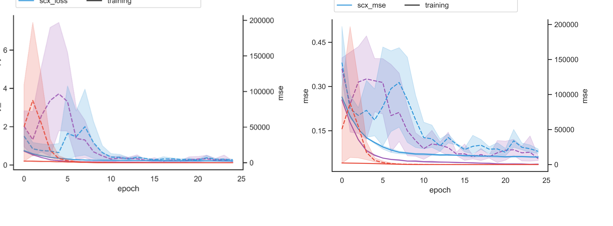
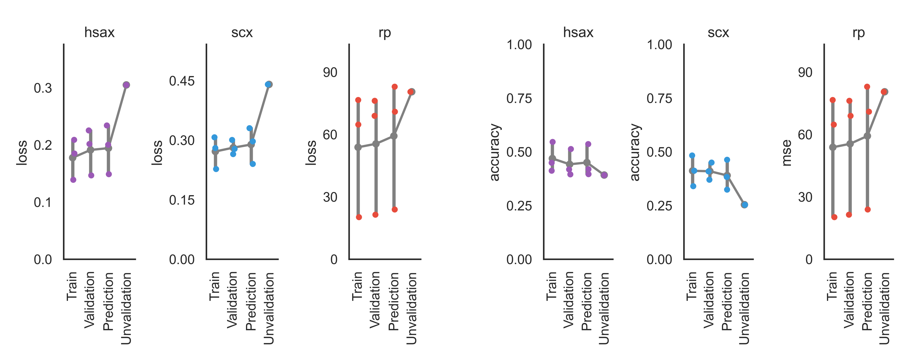
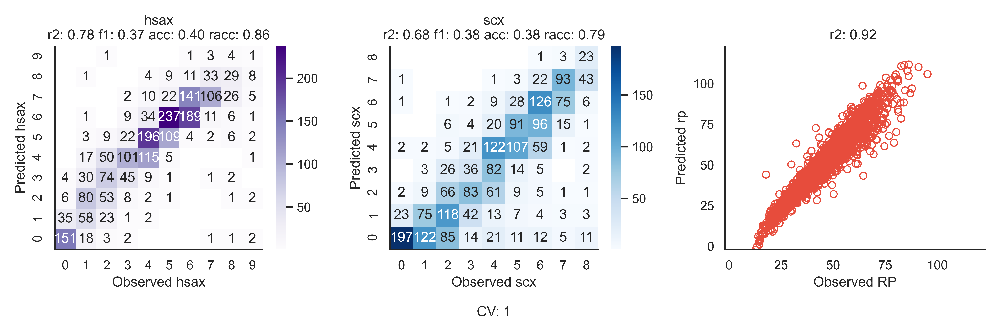

Results
=======

This section covers the results that are generated after a successful xiRT run. In the command
line call the output folder needs to be specified. Typically, the csv/xls files are the most
important outputs for most applications. The created folder will contain the following results:

1) log file
2) callbacks
3) quality control visualizations
4) tables (CSV/XLS)

For which you find more details in the following paragraphs.

Log File
********
The log file contains useful information, including the xiRT version and parameters. Moreover
various steps that are performed during the analysis with xiRT are documented. For example,
the number of duplicated entries, the amino acid alphabet, maximum sequence length etc. The logs
also contain short numeric summaries from the CV training of xiRT.

.. code-block:: console

    2021-01-04 17:21:31,708 - xirt - INFO - Init logging file.
    2021-01-04 17:21:31,708 - xirt - INFO - Starting Time: 17:21:31
    2021-01-04 17:21:31,708 - xirt - INFO - Starting xiRT.
    2021-01-04 17:21:31,708 - xirt - INFO - Using xiRT version: 1.0.63
    2021-01-04 17:21:31,781 - xirt.__main__ - INFO - xi params: sample_data/xirt_params_3RT.yaml
    2021-01-04 17:21:31,781 - xirt.__main__ - INFO - learning_params: sample_data/learning_params_training_cv.yaml
    2021-01-04 17:21:31,781 - xirt.__main__ - INFO - peptides: sample_data/DSS_xisearch_fdr_CSM50percent.csv
    2021-01-04 17:21:31,781 - xirt.predictor - INFO - Preprocessing peptides.
    2021-01-04 17:21:31,781 - xirt.predictor - INFO - Input peptides: 17886
    2021-01-04 17:21:31,781 - xirt.predictor - INFO - Reordering peptide sequences. (mode: crosslink)
    2021-01-04 17:21:43,726 - xirt.processing - INFO - Preparing peptide sequences for columns: Peptide1,Peptide2
    2021-01-04 17:21:44,296 - xirt.predictor - INFO - Duplicatad entries (by sequence only): 5426/17886
    2021-01-04 17:21:44,312 - xirt.predictor - INFO - Encode crosslinked residues.
    2021-01-04 17:21:46,910 - xirt.predictor - INFO - Applying length filter: 17886 peptides left
    2021-01-04 17:21:46,920 - xirt.processing - INFO - Setting max_length to: 59
    2021-01-04 17:21:47,012 - xirt.processing - INFO - alphabet: ['-OH' 'A' 'D' 'E' 'F' 'G' 'H' 'H-' 'I' 'K' 'L' 'M' 'N' 'O' 'P' 'Q' 'R'
     'S' 'T' 'V' 'W' 'Y' 'clA' 'clD' 'clE' 'clF' 'clG' 'clI' 'clK' 'clL' 'clM'
     'clN' 'clP' 'clQ' 'clR' 'clS' 'clT' 'clV' 'clY' 'clcmC' 'cloxM' 'cmC'
     ...
     ...
    2021-01-04 17:28:38,903 - xirt.qc - INFO - Metrics: r2: 0.30 f1: 0.16 acc: 0.25 racc: 0.61
    2021-01-04 17:28:39,207 - xirt.qc - INFO - QC: rp
    2021-01-04 17:28:39,215 - xirt.qc - INFO - Metrics: r2: 0.69
    2021-01-04 17:28:43,643 - xirt.__main__ - INFO - Writing output tables.
    2021-01-04 17:29:01,207 - xirt.__main__ - INFO - Completed xiRT run.
    2021-01-04 17:29:01,207 - xirt.__main__ - INFO - End Time: 17:29:01
    2021-01-04 17:29:01,208 - xirt.__main__ - INFO - xiRT CV-training took: 7.20 minutes
    2021-01-04 17:29:01,209 - xirt.__main__ - INFO - xiRT took: 7.49 minutes

Callbacks
*********
Callbacks are used throughout xiRT to select the best performing model which is not necessarily
the last (epoch) model that was trained. To reuse the already trained models for transfer-learning
and predictions on other data sets the neural network model ("xirt_model_XX.h5") as well as the
parameters/weights ("xirt_weights_XX.h5") are stored. In addition training results per epoch
are stored ("xirt_epochlog_XX.log"). XX refers to the cross-validation fold, e.g. 01, 02 and 03 for
k=3. The epoch log contains losses and metrics for the training and validation data. For some
applications the used encoder (mapping of amino acids to integers) needs to be transferred.
Therefore, the callbacks also include a trained label encoder from sklearn as pickled object
("encoder.p"). The last file contains the formatted input data again as pickled data. It can
be used programmatically for debugging, exploration and manual retention time prediction using
an already existing model. The data can be parsed in python via:

.. code-block:: python

    import pickle
    X, y = pickle.load(open("Xy_data.p", "rb"))
    alpha_peptides, beta_peptides = X[0], X[1]
    # assuming 3 RT dimensions
    RT1, RT2, RT3 = y

Visualizations
**************
xiRT will create a rich set of QC plots that should always be investigated. The plots are stored
in svg/png/pdf format.

Epoch  Loss / Metrics
'''''''''''''''''''''

The epoch loss/metrics plot shows the training behavior over the epochs and is a good diagnostic tool to
assess robustness across CV-folds, learning rate adjustment, overfit-detection and general learning
behavior across tasks. In the example above, we see quick convergence and robust learning behavior
after 10 epochs. In non-regression tasks loss and metrics are not necessarily the same.

CV Summary
'''''''''''

The CV summary shows the point estimates of the loss/metric for the training, validation
and prediction folds for all training tasks. Unvalidation refers to the data not passing the
training FDR cutoff.

CV Observations
'''''''''''''''

This plot shows the prediction performance for each CV-fold on all tasks. It also reports some
key metrics that are not reported in the epoch log (r2, f1, accuracy, relaxed accuracy).

Tables
******
The tables contain a lot of extra information (some of which is used for the plots above). Please
find an example of each file on (GitHub)[].

Processed PSMS
''''''''''''''
This table ("processed_psms.csv") contains the input data together with internally done
processing steps. The additional columns are:
- swapped (indicator if peptide order was swapped)
- Seq_Peptide1/Seq_Peptide2 (peptide sequences in modX format)
- Seqar_Peptide1/Seqar_Peptide2 (peptide sequences in array format
- Duplicate (indicator if combination of sequences and charge is unique within the xiRT definition)
- scx0_based (0-based fraction number)
- scx_1hot (1-hot encoded fraction variable)
- scx_ordinal (ordinal encoded fraction variable)
- fdr_mask (indicator if PSM passed the FDR for training)

Epoch History
'''''''''''''
This table ("epoch_history.csv") has similar data as the callbacks version but the CV results are
concatenated and learning rate decay is documented.

Error Features
''''''''''''''
This table ("error_features.csv") contains the input PSMID, crossvalidation split annotation
and the predicted retention times (including their basic error terms).

Error Features Interactions
'''''''''''''''''''''''''''
This table ("error_features_interactions.csv") contains the input PSMID,
and the some engineered error terms from the previous table.

Model Summary
'''''''''''''
This table ("model_summary.csv") contains important metrics that summarize the performance of the
learned models across CV-splits and their corresponding train/validation/prediction splits.
